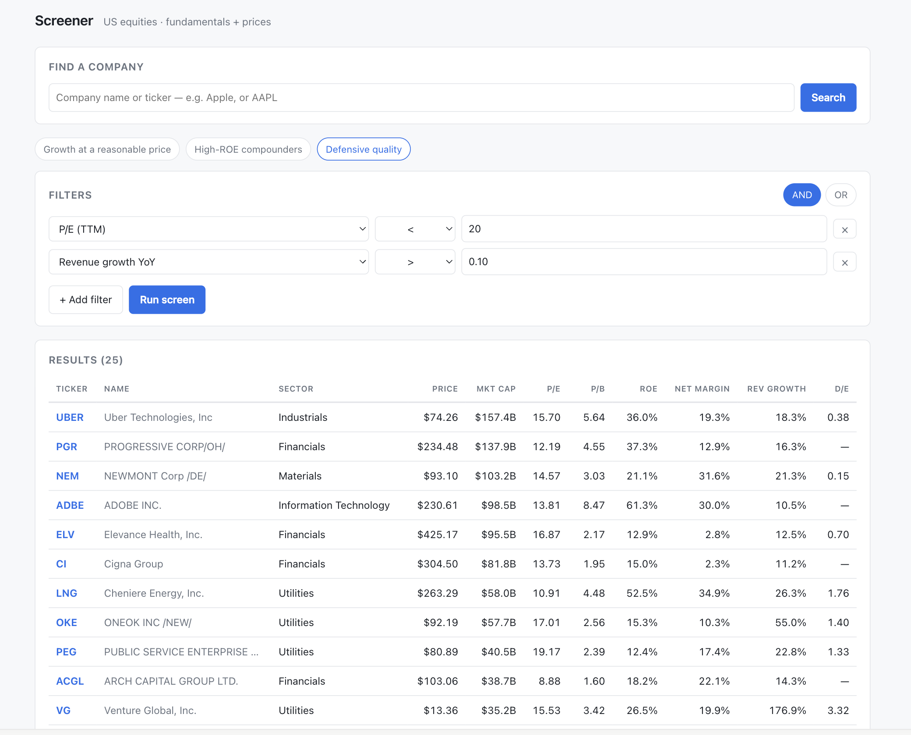

# Screener — US Equities Fundamental Screener

A full-stack stock screener over the **entire US public-company universe**: it ingests
SEC XBRL filings and daily prices for **7,636 companies**, precomputes every valuation
and growth ratio, and answers arbitrary boolean screens — *"P/E < 20 AND revenue growth
> 10% AND sector = Information Technology"* — in **~20 ms**.

Think Screener.in, for US stocks.



<sub>*A live screen over all 7,636 companies — `P/E < 20 AND revenue growth > 10%` — returned in ~20 ms.*</sub>

## How it works

The system does its thinking **once a day**, so that answering a question is just a lookup.
Everything meets at the database — the loader and the website never talk to each other.

```
   ONCE A DAY  ·  all the expensive work happens here
   ┌──────────────────────────────────────────────────────────┐
   │   SEC filings ─┐                                         │
   │                ├─► clean it up ─► work out every ratio   │
   │  Daily prices ─┘   (one shape)     for all 7,636 firms   │
   └────────────────────────────┬─────────────────────────────┘
                                │  writes
                                ▼
                ┌─────────────────────────────────┐
                │           PostgreSQL            │
                │  one row per company, with      │
                │  every metric already computed  │
                └─────────────────────────────────┘
                                ▲
                                │  reads  ·  one indexed lookup, ~20 ms
   ┌────────────────────────────┴─────────────────────────────┐
   │   You type a filter ─► website ─► API ─► reads the row   │
   └──────────────────────────────────────────────────────────┘
   ON EVERY SEARCH  ·  nothing is calculated, only looked up
```

**Top half — the loader (`etl/`).** Once a night it downloads company filings from the SEC and
that day's closing prices, converts thousands of inconsistent accounting tags into one tidy
shape, and calculates every ratio a user might screen on — P/E, margins, growth, debt levels —
for all 7,636 companies. It writes the results as a single row per company.

**Bottom half — the website (`web/`) and API (`api/`).** When you run a screen, nothing is
computed. The API translates your filters into one database lookup against those pre-built rows
and returns the matches. That's the whole reason it answers in ~20 ms instead of seconds.

**Why the database sits in the middle.** The loader only ever *writes*; the API only ever
*reads*. They share nothing but the table between them, so either can be rebuilt, restarted or
replaced without touching the other — and if the nightly load fails, the site keeps serving
yesterday's data instead of going down.

| | |
|---|---|
| Companies | **7,636** filers (entire SEC ticker universe) |
| Financial facts | **2.37 M** normalized, restatement-versioned |
| Daily prices | **2.59 M** rows across 483 trading days |
| Screen latency | **~20 ms** over the full universe |
| Daily refresh cost | **1** price API call + 2 SEC bulk downloads |
| Tests | 81 |

---

## The core design decision

**Precompute at ingest; never compute at query time.**

Every ratio, growth figure and multi-period boolean flag is computed once per daily ETL
run and written to a denormalized `screener_metrics` table — one row per company. A user
screen is therefore a *single indexed `SELECT` over one table*: no joins, no external API
calls, no per-row math.

That is what makes an arbitrary boolean query over 7,636 companies return in 20 ms, and
it is why the latest cross-section (a few MB) lives permanently in Postgres'
`shared_buffers`.

The corollary shapes everything else: multi-period predicates like *"revenue grew four
quarters straight"* are **also** resolved at ETL time, materialized as boolean columns
(`rev_up_4q`, `profitable_5y`), so even historical logic stays a single-table filter.

---

## Safe dynamic queries

The frontend sends a JSON predicate tree; the backend compiles it to SQL. That is an
injection surface by construction, so it is closed by construction:

```jsonc
{ "op": "AND", "rules": [
    { "field": "pe_ttm",             "op": "<",  "value": 20 },
    { "field": "revenue_growth_yoy", "op": ">",  "value": 0.10 },
    { "field": "sector",             "op": "IN", "value": ["Information Technology"] }
]}
```

* Every field is looked up in a **whitelist** mapping `field → {column, type, allowed ops}`.
  Anything not in it is rejected — column identities can only ever come from that map.
* Values become **bound parameters**. No user input is ever string-interpolated into SQL.
* Values are coerced to the column's declared type (numerics as `Decimal`, never float),
  and `BETWEEN`/`IN` arity is validated.
* Nesting depth and condition count are capped.

The query builder in the UI renders itself from `GET /fields`, i.e. from the same
whitelist — so the frontend *cannot* offer a field or operator the compiler would reject.

---

## Running it

Requires Docker and Python 3.9+.

```bash
docker compose up -d                      # Postgres + TimescaleDB, Redis
pip install -e ".[api,dev]"
alembic upgrade head

cp .env.example .env                      # add a free Polygon key for prices
python -m etl --sample                    # 20-ticker smoke run (~1 min)
# python -m etl                           # full 7,636-company universe (~5 min)

uvicorn api.main:app --reload             # API  → :8000
npm install --prefix web && npm run dev --prefix web   # UI → :5173
```

Runs entirely locally. See [DEPLOY.md](./DEPLOY.md) for the production setup
(one VM, same-origin behind Caddy, TLS, per-IP rate limiting).

---

## Data quality is the actual engineering

The pipeline ran fine on 20 mega-caps. Scaling to 7,636 filers surfaced **six** defects
that a small sample structurally cannot reveal. Four aborted the run outright. **Two were
far worse — they produced plausible-looking numbers.**

| Defect | Real example found in production data | Fix |
|---|---|---|
| **Currency silently read as USD** | Nomura files `Revenues` in *both* JPY and USD. Merging units read ¥4.76 tn as $4.76 tn and ¥118.99 EPS as $118.99 — a **P/E of 0.08** and a **$29 quadrillion** market cap, sorted to the top of the front page | read only each concept's own unit (`USD`, `USD/shares`, `shares`) |
| **ADR price ÷ ordinary-share count** | Alibaba trades 1 ADS : 8 ordinary shares. Price is per ADS, the filed share count is per ordinary share, and the ratio is nowhere in SEC data → **$2,161 B** and **140× P/E** vs a true ~$300 B / ~17× | 20-F/40-F filers get NULL price multiples; their fundamentals are unaffected |
| Share count contradicting the filer's own arithmetic | Bicara filed 54,676,896,000 diluted shares — 1,000× its real ~54.7 M — valuing a small biotech at **$1.5 trillion** | cross-check `shares ≈ net_income / EPS`; disagree by >10× → NULL, plus an absolute ceiling |
| Fact dated *after* the filing that reported it | a 10-Q filed 2023 reporting a period ending **2031**; equity "as of" 2029 filed in 2020 | reject `period_end > filed`. Balance-sheet *instants* have no duration, so nothing else catches them — and a bogus year hard-fails a range-partitioned table |
| Ratio overflows its column | a shell with $1 revenue and a $1 M loss has a net margin of −1,000,000 against `NUMERIC(8,4)`; Postgres **aborts the INSERT** rather than truncating | value too large for its column → NULL, never a crash |
| Volume exceeds int32 | ADTX traded **4,808,332,396** shares in one session — 2.2× the ceiling | model types must match the schema; a bare `Mapped[int]` infers 32-bit even when the column is `BIGINT` |

The governing principle throughout: **NULL beats a fabricated number.** A missing market
cap is visible; a P/E quietly denominated in yen is not. Every guard is regression-tested
against the actual offending filing.

Two more that shape the ingest, documented in [ARCHITECTURE.md §6](./ARCHITECTURE.md):
SEC's per-fact `fy`/`fp` labels describe the *filing*, not the fact (10-Ks embed prior-year
comparatives; 10-Qs embed trailing-twelve-month figures), and filers switch XBRL tags
mid-history — ASC 606 moved revenue tags around 2018, silently truncating recent history
for large caps unless every synonym tag is merged.

---

## Cost engineering

Naïvely, 7,636 companies means 7,636 API calls a day. Both data sources were chosen to
make cost **flat in universe size** instead:

* **Fundamentals** — SEC publishes the entire corpus as two bulk zips (~2.7 GB). One
  download each, streamed per CIK. The zips *are* the bronze archive; nothing is expanded
  to disk.
* **Prices** — Polygon's grouped-daily endpoint returns **every US ticker for a trading
  day in a single request** (~12,400 tickers). Staying current costs **one call per day**,
  whether the universe is 20 tickers or 8,000.

Because bronze stores the *whole market* snapshot and only then filters to the tracked
universe, **widening the universe costs zero new API calls** — the backfill replays what
is already on disk. Going from 20 → 7,636 tickers reprocessed two years of price history
in 19 seconds without touching the vendor.

---

## Stack

**ETL** Python · SQLAlchemy 2.0 · streaming zip ingest · idempotent, resumable
**API** FastAPI (async) · asyncpg · Pydantic · Redis cache-aside with O(1) versioned invalidation
**DB** PostgreSQL 16 · TimescaleDB hypertable for OHLCV · `financial_facts` range-partitioned by fiscal year
**Web** React 18 · TypeScript · Vite · TanStack Query · lightweight-charts
**Infra** Docker Compose · Caddy (auto-TLS, same-origin) · Alembic migrations

Three independently deployable modules (`etl/`, `api/`, `web/`) sharing only the database
contract.

---

## Known limitations

Deliberate, and documented rather than hidden:

* **`sector` is SIC-derived, not GICS.** True GICS is proprietary (S&P/MSCI licensed).
  SEC's own SIC codes are free and cover every filer; ~15/20 of a sample match GICS, but
  SIC predates the digital economy, so Alphabet and Meta land in Information Technology
  rather than Communication Services. Swapping in a licensed feed repopulates the same
  two columns.
* **~2 years of price history**, not the 10-year target — the free vendor tier's ceiling.
  This is what currently gates chart range selection, 52-week-high screens and the
  Timescale continuous aggregates.
* **`ev_ebitda` and `dividend_yield` are NULL** — they need D&A/cash concepts and a
  dividends load respectively.
* **One row per *filer*, not per security.** ~960 filers list multiple share classes;
  only the primary class (SEC's own first listing) is screenable.
* **No authentication.** The API is public and throttled per-IP only.

---

## Documentation

* **[ARCHITECTURE.md](./ARCHITECTURE.md)** — full system design, schema, screener
  strategy, and the data-source constraint tables. The source of truth.
* **[DEPLOY.md](./DEPLOY.md)** — production deployment, and the data-licensing
  considerations for serving vendor price data publicly.

## Data sources

Fundamentals and company reference data come from **SEC EDGAR** (public domain). Price
data comes from a commercial vendor's free tier — note that free market-data tiers
generally permit internal use but **prohibit redistribution**, which is why no public
instance of this is hosted.
